# osgb 倾斜摄影数据转换为 3dtiles

## 使用 OSGBLab （倾斜伴侣）转换

### 官网

- OSGBLab [官网地址](http://www.osgblab.com/)

  ```
  http://www.osgblab.com
  使用此网站可以下载软件，软件是免费使用的

  软件只支持windows7 64bit及以上的操作系统
  ```

### 转换数据

- 准备 osgb 数据
  ```
  完整的 osgb 数据:
  1.metadata.xml  xml 文件
  2.Data  文件夹
  3.osbg  倾斜摄影数据
  ```
  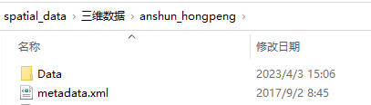
  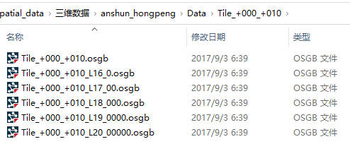
- 使用 OSGBLab
  ```
  1. <btn:OSGB转Cesium 3DTile>
  2. 输入目录：选择倾斜摄影数据目录
  3. 输出目录：选择输出 3dtiles 的目录
  ```
  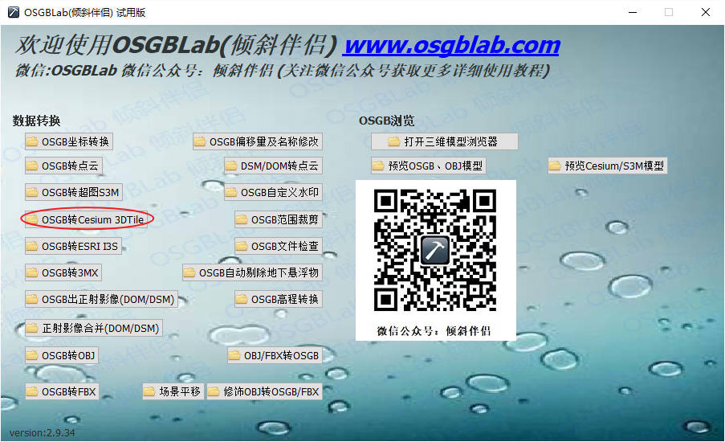
  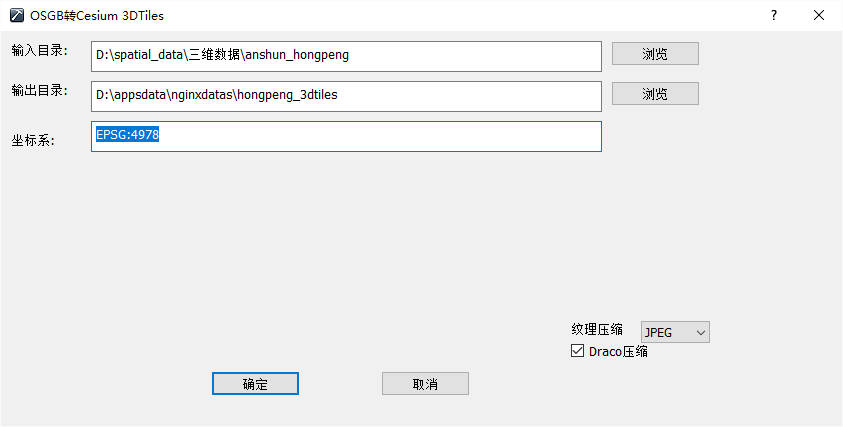

### 浏览数据

- 浏览 osgb 数据
  ```
  <menu:OSGB浏览:预览OSGB、OBJ模型>
  ```
- 浏览转换后的 3dtiles 数据
  ```
  <menu:OSGB浏览:预览Cesium/S3M模型>
  ```
## 使用 Cesiumlab 转换

### 官网

- cesiumlab [官方地址](http://www.cesiumlab.com)
  ```
  1.http://www.cesiumlab.com 使用此网站可以下载软件，注册账号后部分功能可以免费使用
  2.该软件必须联网，因为需要登录才能使用
  ```

### 转换数据

- 准备 osgb 数据
- 打开转换页面
  ```
  1. 登录 cesiumlab
  2. 选择 <menu:数据处理:倾斜模型切片>
  ```
  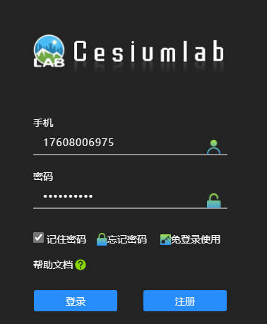
  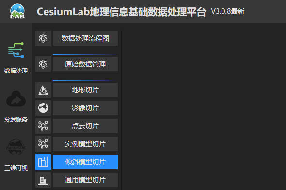
- 参数：输入文件
  ```
  数据路径：osgb 数据路径，Data 文件夹
  空间参考：选择 osgb 数据后会自动填写
  零点坐标：自动填写
  ```
  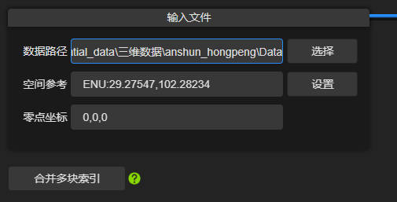
  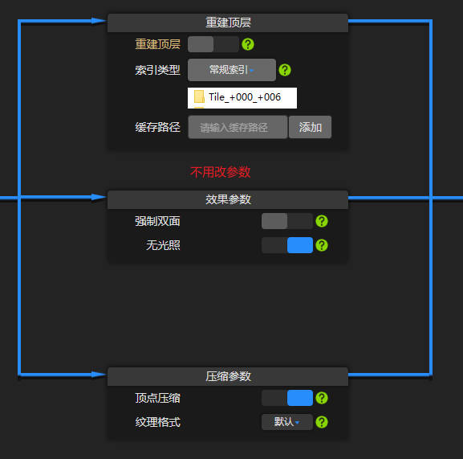
- 参数：存储类型
  ```
  存储类型：选择散列
  输出路径：选择 3dtiles 的存储路径
  ```
  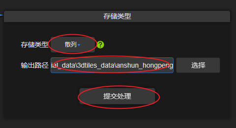
- 提交
  ```
  进行数据处理
  ```
- 查看处理情况
  ```
  <menu:数据处理:正在运行>
  ```
  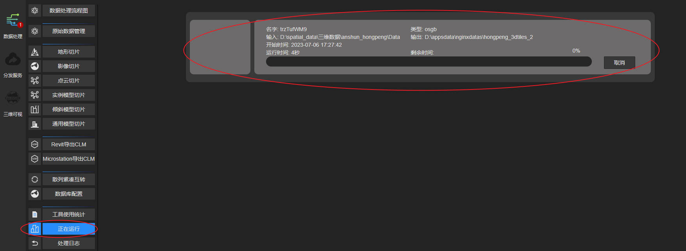
- 查看日志
  ```
  <menu:数据处理:处理日志>
  ```
  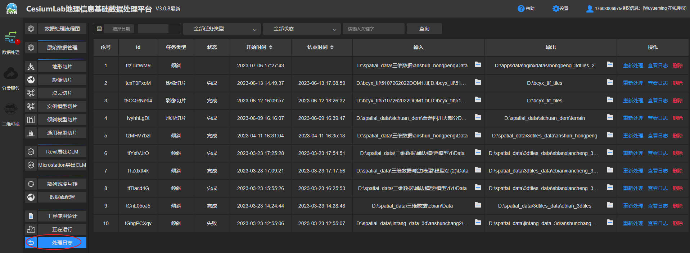
