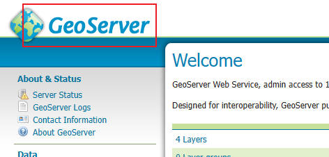
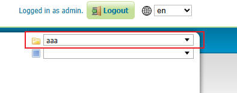
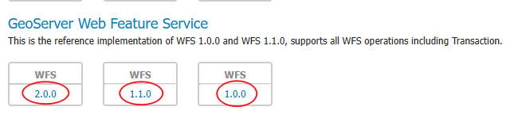
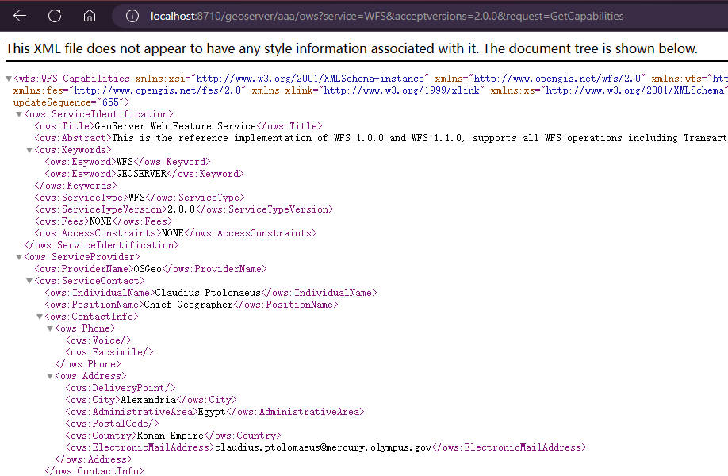

# 配置和加载 WFS

## WFS 设置

- 配置位置

  ```
  <menu:Services> -> <menu:WFS>
  ```

- Features

  ```
  Maximum number of features:要素最大数量
  Maximum number of features for preview:预览时请求的要素最大数量
  ```

- Service Level

  ```
  服务级别
  Basic：只读级别，可查询
  Transactional：事务级别，可增删查改
  Complete：完整功能，可加锁
  ```

- Allowed Output Format types for a GetFeature request

  ```
  在使用 GetFeature 时，允许的输出格式类型
  Enable OutPut Format type checking:启用输出格式检查，选中后可配置输出格式，默认输出支持的所有格式
  ```

- Extra SRS codes for WFS capabilities generation

  ```
  生成 WFS 功能的额外 SRS 代码
  可在输入框中添加额外的 SRS 代码，使用逗号分割多个代码
  比如：
  3857,4326,4523,4490
  ```

## 查看参数

- 打开首页

  ```
  首页地址
  http://localhost:8710/geoserver/web/?44
  ```

  

- 选择工作空间  
  
- 进入 WFS 参数列表页
  ```
  点击版本后进行列表参数页面
  ```
  
- 例如：2.0.0
  ```
  地址
  http://localhost:8710/geoserver/aaa/ows?service=WFS&acceptversions=2.0.0&request=GetCapabilities
  ```
  
- 参数页面标签说明

```
reqeust  请求类别
GetFeature：请求要素，实际请求的时候使用
GetCapabilities：用于查看 wfs 请求的参数

AcceptVersions  请求版本
版本越高，功能越强大，但是可能不兼容，多尝试

GetFeature.outputFormat  输出格式
application/json  geojson 格式
SHAPE-ZIP  下载 shp 数据，格式为 zip
```
