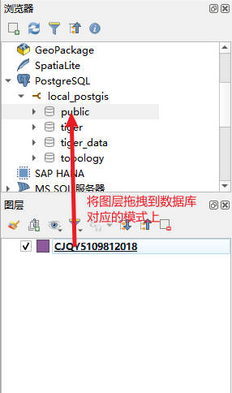
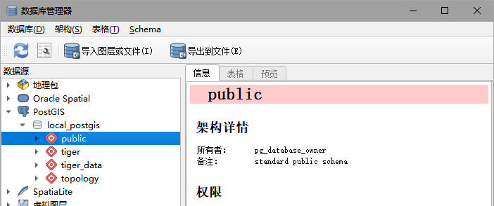
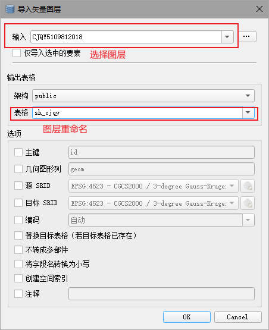

# 导入 shp
## # 使用官方工具导入 shp
1. 准备 shp 文件
```
准备完整的 shp 文件 (shp,prj,dbf,shx)
```
2. 打开导入工具
```
PostGIS -> PostGIS Shapefile and DBF loader Exporter
```


3. 连接数据库
```
<btn:View connection details>

输入用户名、密码等
```
4. 添加文件
```
<btn:Add File>

添加需要导入的 shp 文件
注意：路径之中不能有中文
```
5. 配置
```
<btn:Options>
配置导入选项，注意 dbf 字符编码格式，格式可以在 qgis 中查看
```
6. 导入
```
<btn:Import>
```
## # 使用 QGIS 导入 shp
1. 准备
```
1.准备 shp 文件
2.安装 QGIS
3.使用 QGIS 连接数据库
```
2. 导入方式——使用拖拽方式导入
```
1.将 shp 加载到 qgis 的图层列表中

2.在 qgis 浏览器窗口连接 PostgreSQL

3.将图层拖拽到 public 中，开始导入

4.导入成功后会提醒导入成功
```

3. 导入方式——使用数据库管理器方式导入
```
<menu:数据库> -> <menu:数据库管理器> -> 连接数据库 -> 选择 scheme

<btn:导入图层或文件> -> 选择输入图层 -> 指定输出表格名称 -> <btn:Ok>
```


