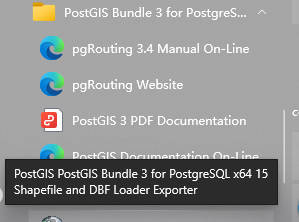
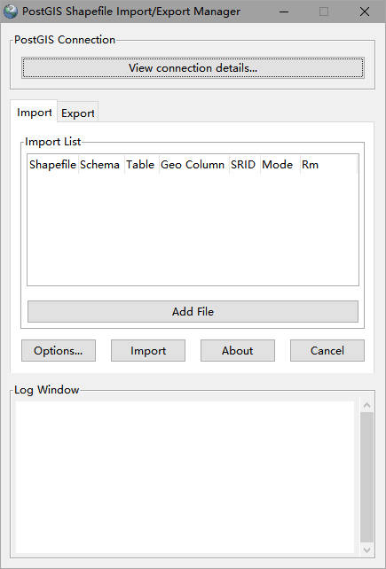

# 导入 shp
1. 准备 shp 文件
```
准备完整的 shp 文件 (shp,prj,dbf,shx)
```
2. 打开导入工具
```
PostGIS -> PostGIS Shapefile and DBF loader Exporter
```


3. 连接数据库
```
<btn:View connection details>

输入用户名、密码等
```
4. 添加文件
```
<btn:Add File>

添加需要导入的 shp 文件
注意：路径之中不能有中文
```
5. 配置
```
<btn:Options>
配置导入选项，注意 dbf 字符编码格式，格式可以在 qgis 中查看
```
6. 导入
```
<btn:Import>
```